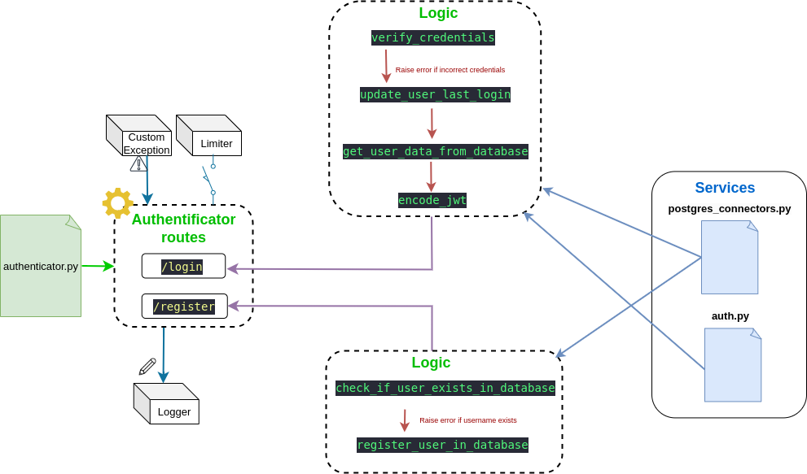

# API Documentation


The following document expose how is built the API.


---

## Informations

- **Current Version**: v1
- **Stage**: In Development
- **Last doc update**: 2024-11-12

---

## Table of Contents

- [Installation](#installation)
- [Configuration](#configuration)
- [Architecture](#architecture)
- [API Logic](#api-logic)
  - [Main.py](#main.py)
  - [Authentification](#authentification)
  - [Limiters](#limiters)
- [Development](#development)
  - [Routers](#routers)
  - [Routes](#routes)


## Installation

The API follows the REST standards. A Docker image contains Python and all required dependencies to run the api.

The source code is mounted as a volume directly in the container. This avoids to rebuild the image each time an update is built.


Before starting API service through a Docker container, some environment variables must be set.

The easiest way is to follow the instructions furnished by executing the init_services.sh script (utils/init_services.sh), it only takes 2 minutes to configure !

- Start utils/init_services.sh
- Let the script write api .env file


Once done, .env in ./src/api is generated and read by the docker-compose.yaml file to init the API. You can manually change variables in common.env (utils/common.ev) and .env (src/api/.env)


**!\ WARNING /!**
It is strongly advised to update .env following your preferences and your production environment to limit security risks.


*The API image is autocatically downloaded from our Container registry when using the docker-compose.yaml file to start API services.*


## Configuration


### .env
As mentioned above in the **installation** chapter, you must check the default values in your .env file and adapt them.

The .env file *(./src/api/.env)* is the only configuration file for the api.


- Change DEBUG to False to disable FastAPI DEBUG mode and avoid unattended changes in the API behavior. This must be changed to False in production.
``` .env
# Debug Mode
DEBUG=True
```

- Change LOGGER to True to enable API logger. The logger keep a trace of the different route requests (source, requestion, response code).
- Credentials such as passwords are masked and not logged.
- Change LOG_FILE_PATH if want to change the logs directory.
``` .env
# Logging
LOGGER=False
LOG_FILE_PATH=/app/logs/api.log
```

- By default, limiter is set to "user". user limiter uses user id to limit route requests. Route with non authentication dependencies cannot be limited by this kind of limiter.
- ip limiter uses ip source to limit route requests instead of user id. It can be set on any routes but beware if the API is a node of your archiecture. In this case, route limits should be greatly increased.
``` .env
# Route limiter
LIMITER_TYPE=user  # Change to ip if needed
DEFAULT_LIMITS_FOR_LIMITER=60/minute
STATUS_LIMIT=5/minute
DATABASE_CHECK_LIMIT=5/minute
TEST_LIMIT=10/minute
INSERT_INFOS_LIMIT=3/minute
UPDATE_INFOS_LIMIT=3/minute
PASSWORD_UPDATE_LIMIT=1/minute
USER_LOCATIONS_LIMIT=15/minute
WEATHER_LIMIT=15/minute
CARTO_LIMIT=60/minute
```

- Passwords are hashed before storing in the database. If you change the algorithm, already stored password will fail when authentication if called.
- ENCODING_ALGORITHM is used to encode JWT.
``` .env
# Hash & encryption algorithms & JWT
HASH_ALGORITHM=argon2
ENCODING_ALGORITHM=HS256
ACCESS_TOKEN_EXPIRATION_IN_MINUTES=60
```


- This part is used to connect the APi to the database engines. User passwords are stores as secrets and unavailable in .env file.
- Refers to api [Secrets](#secrets) to check stored passwords
``` .env
# Database connections
POSTGRES_HOST=postgres_beem
POSTGRES_PORT=5432
POSTGRES_API_USER=jag
CARTO_DATABASE=dbcarto
USER_DATABASE=users
MONGODB_HOST=mongodb_beem
MONGODB_PORT=27017
MONGODB_API_USER=jag
MONGODB_DATABASE=data_user_beegis
MONGODB_LOCATION_COLLECTION_NAME=locations
MONGODB_HIVES_COLLECTION_NAME=hives
REDIS_HOST=beem-redis
REDIS_PORT=6379
```

- Cartographic data types is related to stored postgres/postgis data. it enable routes to requests different cartographic parts.
``` .env
# Cartographic data types
AVAILABLE_CARTO_DATA_TYPES=rpg,clc,forest_v2,c1l
```


### Secrets

Secrets are stored in the default secrets direcotry when generated by init_services.sh :
**./utils/secrets**

Database password are stores in the API secrets and must be changed in production by secured credentials.


---

## Architecture


The global architecture follows our API guidelines logic.


### Models

The API uses **Pydantic** base models:

**users**
- Password
- User (inherit from Password)
- UserInfos

**user objects**
- Locations
- Hives [WIP]

**params locations**
- ParamsLocations

**Weather**
- WeatherRequest


### Routers

The defined routers have a specific purpose and routes.

- authenticator : Routes to register & login users.
- cartographic: Related cartographic requests routes
- information: Misc informations such as API status, database up check, ...
- tester: test routes to check limiter, logger, authentification ,...
- users: user accounts related routes (update account, change password, get or set new personal location points)
- weather: Related weather open-meteo requests routes


### Services

The services define critical functions used for a specific logic.

- auth: Functions used for the authentification routes (control credentials, encode JWT, get_current_user, ...)
- mongodb_connectors: Functions used to query or insert datas in MongoDB Engine
- postgres_connectors: Functions used to query or insert datas in Postgres Engine
- redis_connectors: Functions user to query or insert datas in Redis Engine
- openmeteo: Functions used to request open-meteo API


### Utils

Utils define common functions used by different services, routes. It also contains additional packages to define the limiter, logger, and other plugins the API can use.

- postgres_requests (dir) : Contains string variables which define, for each, a query.
- config.py : Constants to configure the API are stored here.
- decorators.py : Function decorators used in the API.
- exceptions.py : CustomException class declaration to handle Exceptions through the routes & functions.
- limiter.py : limiter class (from slowapi) to set limit rates on routes.
- logger.py : logger handler and sanitazed BaseHTTPMiddleware to avoid storing critical datas such as passwords in the logs.
- common_functions.py : Common fuctions to hash strings (used for the password as example)


---


## API Logic

The API follows the logic: 
- A route uses services and utils to return a response.
- A service uses utils to work.
- utils are low defined functions or variables to make the entire architecture work.


### Main.py


### Authentification

Authentification service uses 0Auth2.0 and Json Web Token.
Where passing through authentified routes, the token payload contains the following user informations:
- id (uuid)
- username (str)
- role (int)
- role_name (str)
- created_at (timestamp)
- updated_at (timestamp)
- last_login (timestamp)





### Limiters

Two limiters are available :
- ip_limiter used to limit routes based on ip source
- user_id_limiter user to limit routes based on logged user_id

To define which limiter the api should use, refers to LIMITER_TYPE in config.py to set "ip" or "user_id".


Limiters are added as decorators in the routes after package import in the router:
```python
from utils.limiter import limiter


@<router_name>.<method>(f"<route>", tags = [<tags>])
@limiter.limit(<limit>)
[...]
```


## Development

### Routers

#### Step 1
The new router must be added in the routers/ directory.
Make sure to add the following packages in the new router:

<span style="color:red">new_router.py</span>

**FastAPI packages** - *Router declaration, Depends for route authentification, Request for API logger*
``` python
- from fastapi import APIRouter, Depends, Request
```


**API specified functions** - *CURRENT_VERSION pour routes, require_role decorator, CustomException for exception handling, limiter to add request limits*
``` python
from utils.config import CURRENT_VERSION
from utils.decorators import require_role
from utils.exceptions import CustomException
from utils.limiter import limiter
```


#### Step 2
Update <span style="color:red">main.py</span> for add the router to the API declaration.

**Add router package as dependence**
``` python
- from routers.new_router import router_name
```

**Declare the router in API**
``` python
app.include_router(router_name)
```


### Routes

Routes are included in specific routers depending on their purpose.

In the router file, you can declare new routes by following these steps:
- Declare the route through the router
- Add limiter and/or role requirement if needed
- Develop the route function


By this way, you should have this kind of route:

``` python
@<router_name>.<method>(f"<route>", tags = [<tags>])
@limiter.limit(<limit>)
@require_role(role = <role_name>)
def <function_name>(<args>, request: Request, JWT_TOKEN: dict = Depends(get_current_user))
  <instrucions>
  return {}
```

Where:
- <router_name> : Name of the declared router
- <method> : REST method (GET, POST, PUT, DELETE)
- <route> : Route path, ensure to start with /{CURRENT_VERSION} to keep API routes versioning.
- <tags> : route tags

- @limiter.limit(<limit>)  : [Optional] Used to add request ip_limiter. In this case, you must add the arg request: Request in the function. Prefer CONSTANTS as limit rate.
- @require_role(role = <role_name>) : [optional] Force role permissions

*args*: - Add these args in your route depending the case:
- request: Request -> If you added a limiter (limiter needs to get some informations such as request source IP)
- JWT_TOKEN: dict = Depends(get_current_user) -> If your route requires authentification

JWT_TOKEN arg grants a decoded token to your route where you can access payload containing some user **critical** informations (username, id, role, ..)